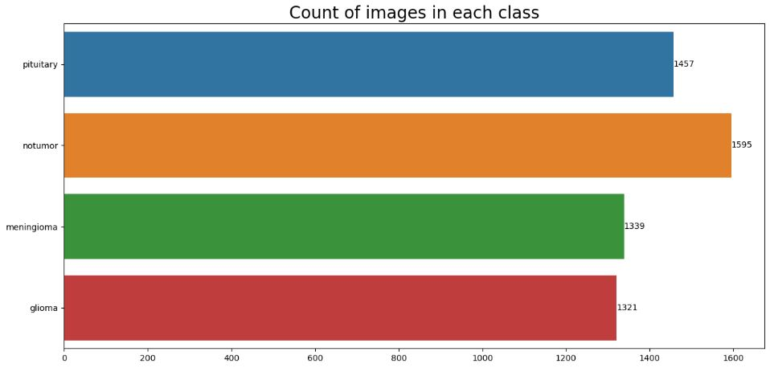
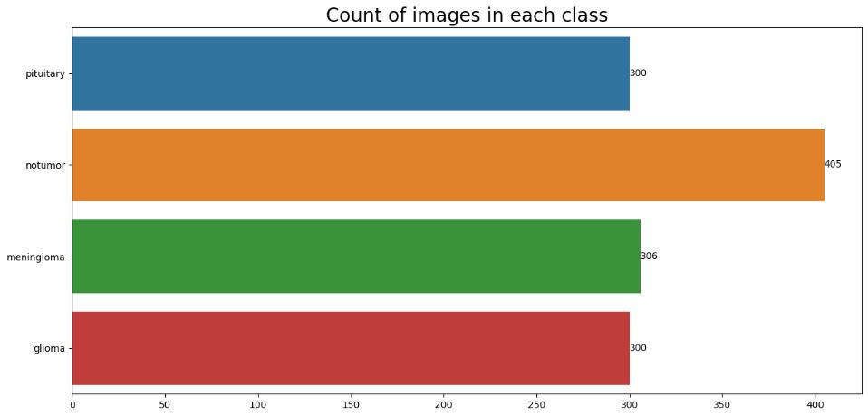
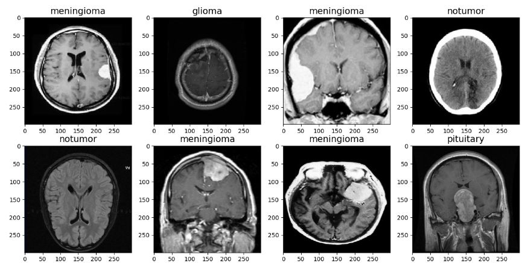
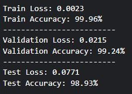
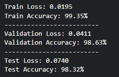
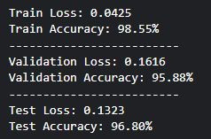
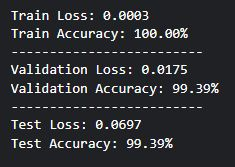
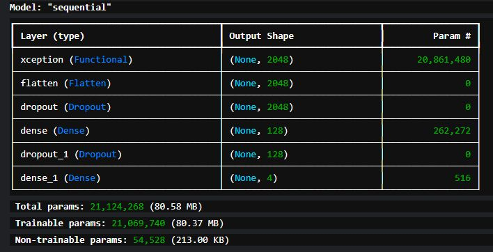

# Brain Tumor Classification 

  

## Problem Statement
A brain tumor is a mass of abnormal cells that grows in the brain, it can be benign (non-cancerous) or malignant (cancerous). Its symptoms are:

- Headaches, which can be severe, persistent, or come and go
- Seizures, which can be mild or severe
- Weakness or paralysis in part of the body
- Loss of balance
- Changes in mood or personality
- Changes in vision, hearing, smell, or taste
- Nausea and vomiting
- Difficulty speaking
- Difficulty swallowing

The growth of brain tumors can cause the pressure inside the skull to increase leading to brain damage, and loss of life if not discovered early and properly treated.

This project is aimed at developing a robust brain tumor detection model using Convolutional Neural Networks (CNNs) to automate the analysis of magnetic resonance imaging (MRI) scan by accurately identifying and classifying the tumors at an early stage which can reduce the load on doctors, help in selecting the most convenient treatment method and hence increase the rate of survival.

This project was implemented as a requirement for the completion of [Machine Learning Zoomcamp](https://github.com/DataTalksClub/machine-learning-zoomcamp) - a free course about Machine Learning.

## Exploratory Data Analysis
The dataset used in this project is the [Brain Tumor MRI Dataset](https://www.kaggle.com/datasets/masoudnickparvar/brain-tumor-mri-dataset) from kaggle. 

It consists of 7,023 magnetic resonance imaging scans, annotated in a folder structure of 5,712 test and 1,311 train. The dataset consists of images of no tumour and brain tumor types: pituitary, meningioma, and glioma. The diagrams below show the histogram of the class distribution of training and testing data.

  

  

Finally, some samples of the dataset were drawn as shown below:

  

## First trainings
After conducting the exploratory data analysis, 3 pre-trained deep convolutional neural network models were used to train the data for 10 epochs each with the aim of finding the one that will return the best test accuracy which will then be used to create the final model. The results obtained with BATCH_SIZE = 32 and LEARNING_RATE = 0.001, are shown below:

Xception - 98.93%
InceptionV3 - 98.32%
ResNet101V2 - 96.80%

Xception was selected because of its higher test accuracy

The plot of the run of each model are shown below:

### Xception

  

### InceptionV3

  

### ResNet101V2

  

## Final trainings
After selecting the pre-trained model for the project, its parameters were tuned to get better results which are listed below:

Xception - learning_rate = 0.0005
- Test Accuracy: 98.02%

Xception - learning_rate = 0.0001
- Test Accuracy: 68.29%

All results were lower than the original, so it was retrained which incidentally resulted in better result as shown in the attached result:

  

## The model
The resultant model obtained from the final training was saved in keras format so that it can be hosted online for inferencing. The size of the model on disk is 271 MB which makes it impossible to host directly online and the solution to this problem is to enlist the use of tools that will help in solving this problem. Docker and kubernetes are the defacto tools used to solve this problem. 

The advantages of using docker and kubernetes together are scalability, high availability, portability, security, ease of use, reduced costs, improved agility. The image below shows the summary of the model.

 

  

## The project
After saving the model and deciciding on the tools for inferencing, the next task is to built the project by 
starting with the virtual environment followed by the required files in the sequence shown below:

> pip install pipenv  
> pipenv install tensorflow==2.16.2  
> pipenv install numpy==1.26.4  
> pipenv install pillow flask gunicorn requests keras_image_helper  
> pipenv install --dev notebook==7.2.1 ipywidgets jupyter pandas matplotlib seaborn  

Then 